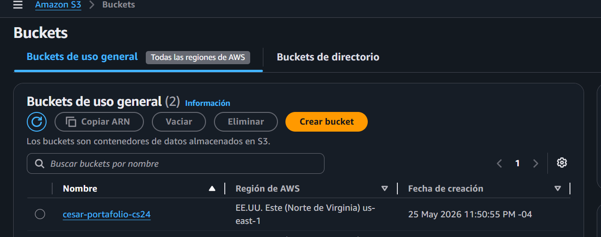
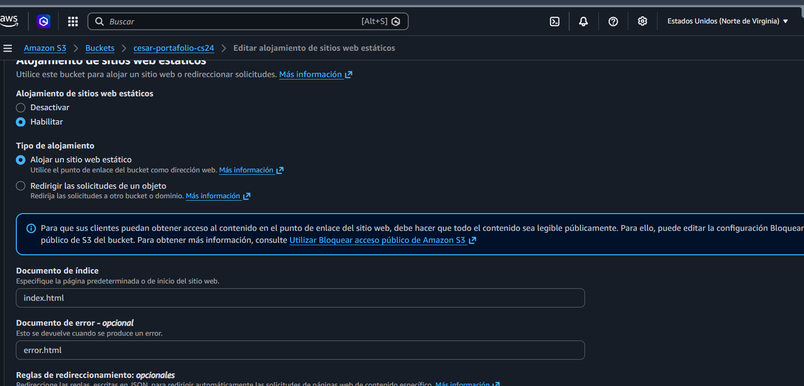
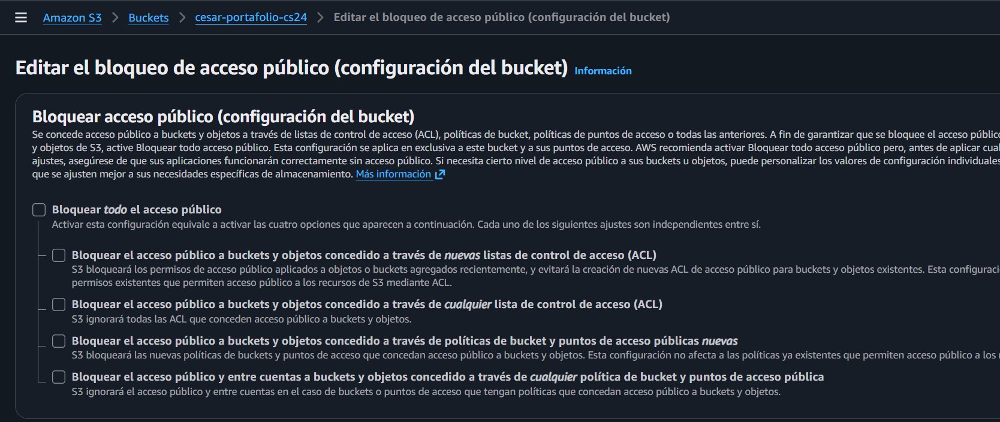
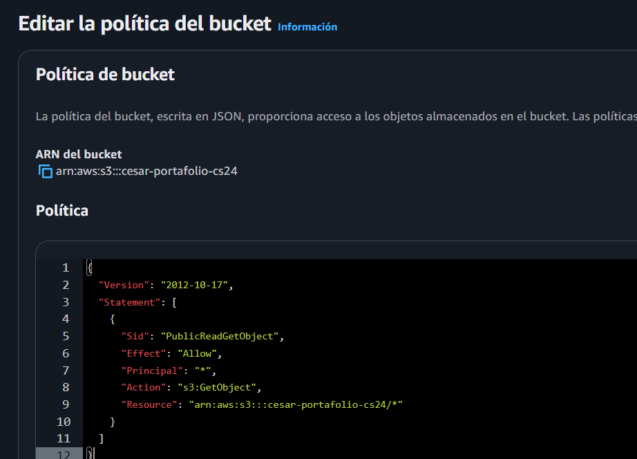
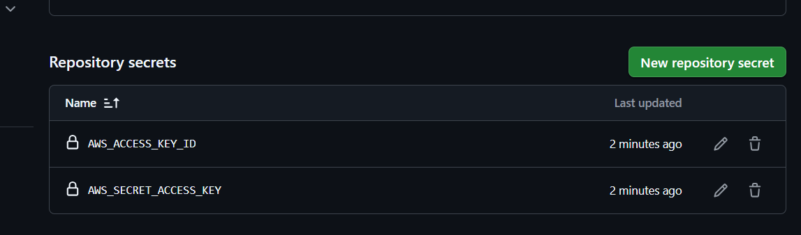
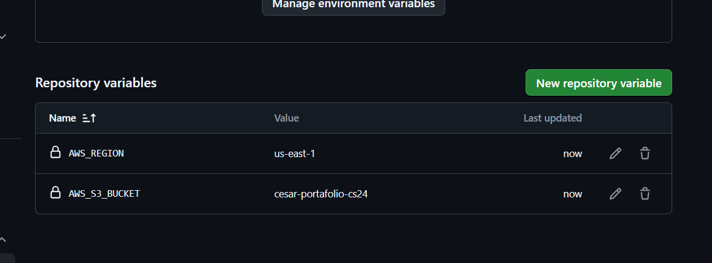
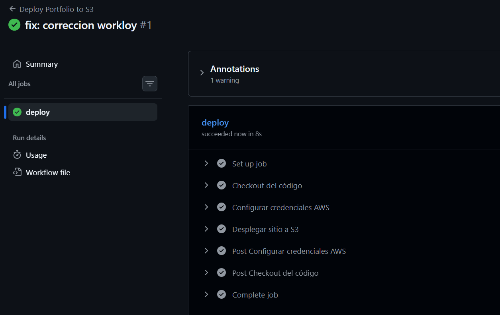
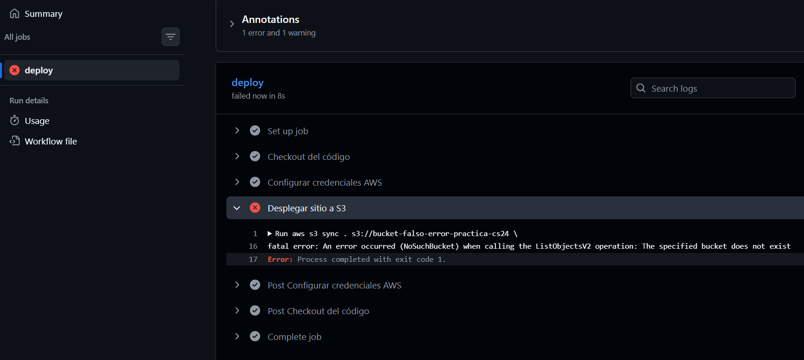
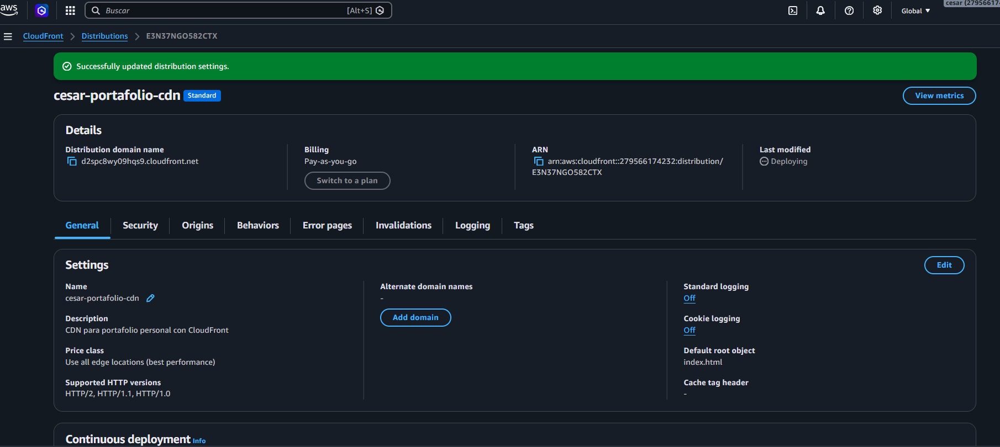
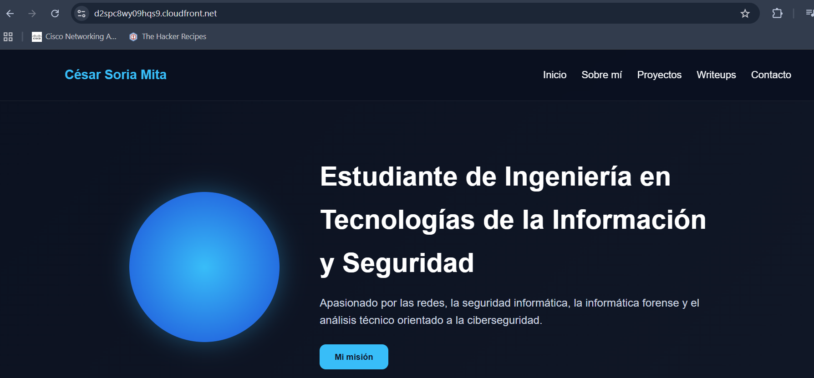

# Informe de Laboratorio – Despliegue de Sitio Web Estático con CI/CD en AWS

## Datos del estudiante

**Nombre:** César Soria Mita  
**Carrera:** Ingeniería en Tecnologías de la Información y Seguridad  

---

## 1. Descripción del proyecto

En esta práctica se desarrolló un portafolio web personal estático con múltiples páginas, diseñado para presentar información profesional, habilidades técnicas, proyectos académicos y publicaciones técnicas relacionadas con redes, seguridad informática e informática forense.

El sitio fue desarrollado utilizando tecnologías web fundamentales como HTML5, CSS3 y JavaScript, implementando una estructura multipágina para mejorar la organización del contenido y brindar una experiencia de navegación más profesional.

Adicionalmente, se implementó un pipeline de integración y entrega continua (CI/CD), permitiendo que cada modificación realizada en el repositorio de GitHub sea desplegada automáticamente en la infraestructura cloud.

La infraestructura implementada incluye:

- Amazon S3 para alojamiento del sitio web estático
- AWS IAM para gestión segura de credenciales
- GitHub Secrets y Variables para configuración segura
- GitHub Actions para automatización del despliegue
- Amazon CloudFront como CDN para distribución segura mediante HTTPS

---

## 2. Tecnologías utilizadas

- HTML5
- CSS3
- JavaScript
- Git
- GitHub
- GitHub Actions
- Amazon S3
- AWS IAM
- Amazon CloudFront

---

## 3. Desarrollo del sitio web

Se desarrolló un portafolio personal multipágina con la siguiente estructura:

```text
cesar-portafolio/
├── index.html
├── sobre-mi.html
├── proyectos.html
├── writeups.html
├── contacto.html
├── css/
│   └── style.css
├── js/
│   └── app.js
├── img/
├── README.md
├── INFORME.md
└── .github/
    └── workflows/
        └── deploy.yml
```

El sitio incluye:

- Página principal
- Página "Sobre mí"
- Página de proyectos
- Sección de writeups técnicos
- Página de contacto
- Interactividad básica mediante JavaScript
- Navegación entre múltiples páginas HTML

El objetivo del sitio fue construir un portafolio técnico personal como evidencia práctica del uso de tecnologías web y despliegue automatizado en la nube.

---

## 4. Configuración de Amazon S3

Amazon S3 fue utilizado como servicio de almacenamiento para alojar el sitio web estático.

Este servicio permite almacenar archivos HTML, CSS, JavaScript e imágenes, ofreciendo alta disponibilidad, escalabilidad y bajo costo para aplicaciones estáticas.

### Creación del bucket

Se creó un bucket dedicado para alojar el portafolio web.



---

### Configuración de hosting estático

Se habilitó la funcionalidad **Static Website Hosting**, permitiendo que Amazon S3 entregue directamente el contenido web al navegador.

Se configuró:

- Documento principal: `index.html`
- Documento de error: `error.html`



---

### Configuración de acceso público

Se deshabilitó temporalmente el bloqueo de acceso público para permitir que el contenido del sitio sea accesible desde internet durante la fase inicial del despliegue.



---

### Política del bucket

Se aplicó una política para permitir acceso público de lectura a los objetos del bucket.

Esta política permite solicitudes HTTP GET para visualizar el contenido del sitio web.



---

## 5. Configuración de GitHub Actions

GitHub Actions fue utilizado como plataforma de automatización para implementar integración y despliegue continuo.

Cada vez que se realiza un `git push` a la rama principal (`main`), el pipeline ejecuta automáticamente el proceso de despliegue.

### Secrets configurados

Se almacenaron credenciales sensibles de AWS de forma segura mediante GitHub Secrets.

Secrets utilizados:

- `AWS_ACCESS_KEY_ID`
- `AWS_SECRET_ACCESS_KEY`



---

### Variables configuradas

Se configuraron variables reutilizables del repositorio para evitar hardcodear configuraciones.

Variables utilizadas:

- `AWS_REGION`
- `AWS_S3_BUCKET`



---

### Workflow de despliegue

El workflow automatiza:

- Obtención del código fuente
- Configuración de credenciales AWS
- Sincronización del contenido con Amazon S3
- Invalidación automática de caché en CloudFront

```yaml
name: Deploy Portfolio to S3

on:
  push:
    branches:
      - main

jobs:
  deploy:
    runs-on: ubuntu-latest

    steps:
      - name: Checkout del código
        uses: actions/checkout@v4

      - name: Configurar credenciales AWS
        uses: aws-actions/configure-aws-credentials@v4
        with:
          aws-access-key-id: ${{ secrets.AWS_ACCESS_KEY_ID }}
          aws-secret-access-key: ${{ secrets.AWS_SECRET_ACCESS_KEY }}
          aws-region: ${{ vars.AWS_REGION }}

      - name: Desplegar sitio a S3
        run: |
          aws s3 sync . s3://${{ vars.AWS_S3_BUCKET }} \
            --delete \
            --exclude ".git/*" \
            --exclude ".github/*" \
            --exclude ".obsidian/*" \
            --exclude "README.md" \
            --exclude "INFORME.md" \
            --exclude "img/*"

      - name: Invalidar caché de CloudFront
        run: |
          aws cloudfront create-invalidation \
            --distribution-id E3N37NGO582CTX \
            --paths "/*"
```

---

## 6. Evidencias de ejecución del pipeline

### Ejecución exitosa

Se verificó la correcta ejecución del workflow con despliegue exitoso.



---

### Fallo intencional y corrección

Como parte del laboratorio, se simuló un fallo intencional modificando temporalmente el bucket de destino del workflow.

Esto permitió observar el comportamiento del pipeline ante errores, revisar logs y aplicar correcciones.

Posteriormente, se restauró la configuración correcta y el despliegue volvió a ejecutarse exitosamente.



---

## 7. Configuración de CloudFront

Amazon CloudFront fue implementado como una **Content Delivery Network (CDN)** para mejorar rendimiento, seguridad y disponibilidad del sitio web.

CloudFront distribuye copias cacheadas del contenido en múltiples ubicaciones edge alrededor del mundo, permitiendo que los usuarios reciban el contenido desde servidores cercanos a su ubicación geográfica.

Beneficios obtenidos con CloudFront:

- Acceso seguro mediante HTTPS
- Menor latencia de carga
- Mejor experiencia de usuario
- Distribución global del contenido
- Reducción de carga directa sobre el bucket S3
- Mejor disponibilidad del sitio
- Integración con mecanismos de control de acceso

Adicionalmente, se utilizó **Origin Access Control (OAC)**.

El OAC permite que únicamente CloudFront pueda acceder al bucket S3, evitando exposición directa del origen y mejorando la seguridad de la arquitectura.

La arquitectura implementada fue:

```text
Usuario
   ↓
CloudFront (HTTPS + Cache + CDN)
   ↓
Amazon S3 (origen)
```

También se configuró invalidación automática de caché en el pipeline CI/CD, garantizando que cada nueva versión desplegada sea visible inmediatamente para los usuarios sin esperar expiración natural del caché.

### Distribución configurada



---

### Sitio accesible mediante CloudFront



---

## 8. URLs públicas

### Endpoint S3

```text
http://cesar-portafolio-cs24.s3-website-us-east-1.amazonaws.com
```

### Endpoint CloudFront

```text
https://d2spc8wy09hqs9.cloudfront.net
```

### Repositorio GitHub

```text
https://github.com/CesarSoria2224/cesar-portafolio
```

---

## 9. Conclusiones

Durante esta práctica se implementó exitosamente un flujo completo de despliegue continuo para un sitio web estático utilizando servicios cloud gestionados de Amazon Web Services.

El desarrollo del portafolio permitió aplicar conocimientos de frontend web mediante HTML, CSS y JavaScript, mientras que la automatización con GitHub Actions permitió establecer un pipeline reproducible y automatizado de despliegue continuo.

Amazon S3 proporcionó una solución eficiente, escalable y económica para el alojamiento de contenido estático.

La integración de Amazon CloudFront representó una mejora importante en la arquitectura, proporcionando distribución global del contenido, acceso seguro mediante HTTPS, menor latencia, almacenamiento en caché e integración segura con el bucket S3.

El uso de Origin Access Control permitió reforzar la seguridad limitando el acceso directo al origen.

En conjunto, esta práctica permitió integrar desarrollo web, automatización CI/CD, despliegue cloud, seguridad de infraestructura y distribución de contenido, consolidando conocimientos prácticos aplicables en entornos reales.